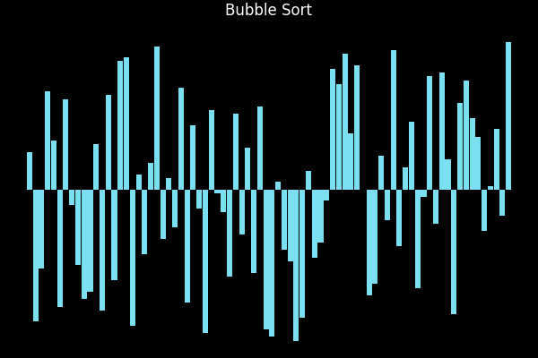
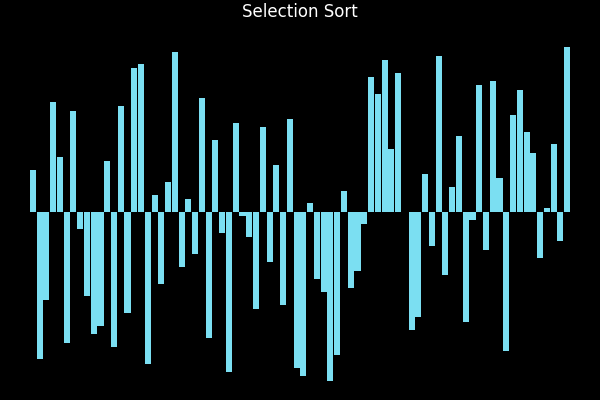
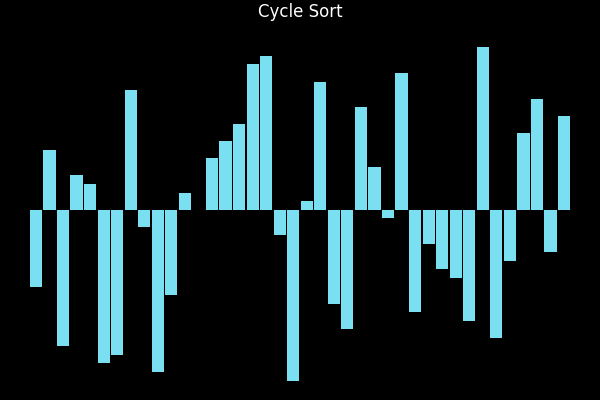
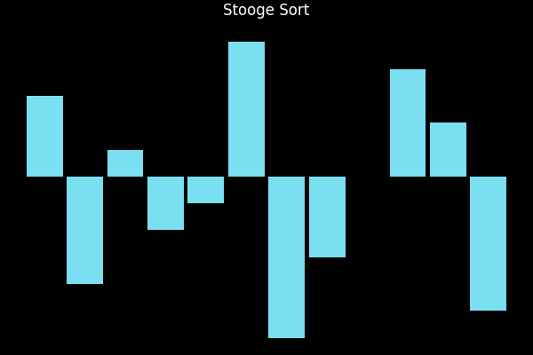
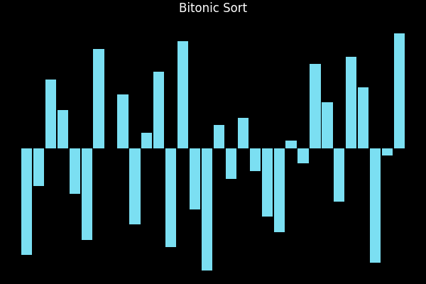
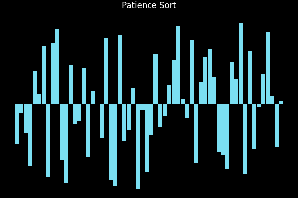
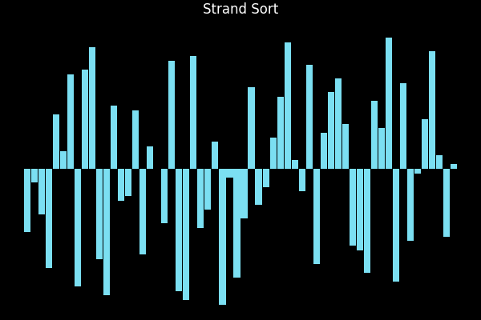
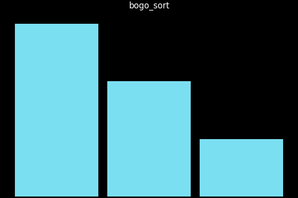

# SortingAlgorithms: An Academic, Cross-Language Atlas of Sorting (with Visual Gallery)

This repository is a research-grade atlas of sorting algorithms with code in Python, C, Go, Rust, and x86-64 assembly. It provides:

- **Per-algorithm source files** for side-by-side comparison.
- **Instrumentation + GIF visualizations** produced from deterministic traces.
- **Extensive commentary** on historical origin, invariants, asymptotics, stability, memory behavior, and use cases.

Use it as a teaching companion, a comparative study reference, or a sandbox for optimization experiments.

---

## How to Reproduce Everything

- Install Python deps: `pip install -r python/requirements.txt`
- Generate all GIFs (uses deterministic sample):
	```sh
	PYTHONPATH=$(pwd)/python:$(pwd) MPLBACKEND=Agg python visualizations/generate_gifs.py
	```
- Run a single algorithm with tracing (Python):
	```sh
	PYTHONPATH=$(pwd)/python python -m sorting_algorithms --algo quick_sort --size 20 --seed 1 --trace
	```
- Build/run other languages: `cd c && make`, `cd go && go run ./cmd`, `cd rust && cargo run`.

---

## Repository Layout

- `python/` — Reference implementations with tracing, CLI, tests, and visualization helpers.
- `c/` — Portable C implementations (one TU per algorithm), built into `libsort.a`.
- `go/` — Go module with algorithms under `go/algorithms` plus demo.
- `rust/` — Rust crate with per-algorithm modules and demo binary.
- `assembly/` — x86-64 System V assembly; several handwritten cores and C-backed fallbacks.
- `visualizations/` — Trace-to-GIF pipeline (Matplotlib + imageio).

---

## Language Parity Snapshot

- **Python**: Complete catalogue with tracing and GIF generation.
- **C**: Complete catalogue in `c/src`, prototypes in `c/sorting_algorithms.h`, builds to `libsort.a`.
- **Go**: Complete catalogue in `go/algorithms`, demo in `go/cmd`.
- **Rust**: Complete catalogue in `rust/src`, re-exported via `lib.rs` and demoed in `main.rs`.
- **Assembly**: One file per algorithm. Handwritten: bubble, insertion, selection, gnome, cocktail_shaker, comb, odd_even, pancake. Others tail-call C for parity.

---

## Algorithmic Mini-Monographs + GIF Gallery

Each entry below contains: origin/story, invariants and efficiency, stability/in-place properties, typical use, and a GIF produced from the Python tracer (`visualizations/gifs/<name>.gif`). If a GIF is missing, regenerate with the command above.

### Elementary (Exchange / Simple Gaps)

**Bubble Sort** — Early teaching staple (Iverson, 1960s). Repeated adjacent swaps float maxima rightward. Best $O(n)$ when already sorted, average/worst $O(n^2)$, stable, in-place, $O(1)$ extra. Good for pedagogy and tiny inputs.



**Cocktail Shaker Sort** — Bidirectional bubble to reduce passes on nearly sorted arrays. Same asymptotics as bubble, unstable due to cross-direction swaps. In-place $O(1)$ extra.


**Odd–Even (Brick) Sort** — Alternates odd/even phases; parallelizable on SIMD/SIMT. $O(n^2)$ average/worst, in-place, unstable. Useful didactically for parallel patterns.


**Gnome Sort** — “Garden gnome” (Hamon, 2000). Deterministic insertion via adjacent swaps walking back when out of order. $O(n^2)$, in-place, unstable.


**Selection Sort** — Minimizes writes (good when writes are costly). Always $O(n^2)$, in-place, unstable; exactly $n-1$ swaps.



**Insertion Sort** — Exploits presortedness: best $O(n)$, worst $O(n^2)$, stable, in-place. Basis for small-partition fallbacks.


**Binary Insertion Sort** — Binary search for position, same data movement as insertion. Stable, in-place, $O(n^2)$ moves, $O(n \log n)$ comparisons.


**Shell Sort (gap halving)** — Diminishing increments (Shell, 1959). Typical $O(n^{3/2})$, worst $O(n^2)$ for this gap schedule, in-place, unstable. Better on medium arrays than plain insertion.


**Comb Sort** — Gap shrinks by ~1.3 to kill turtles faster than bubble. Expected ~$O(n^{3/2})$, in-place, unstable.


**Cycle Sort** — Minimizes writes ($O(n)$ writes) by permuting cycles. $O(n^2)$ time, in-place, unstable. Good for write-constrained media (e.g., EEPROM).



**Pancake Sort** — Prefix reversals only; inspired by Gates & Papadimitriou’s “pancake flipping”. $O(n^2)$, not stable, not strictly in-place (uses flips). Pedagogical.


**Stooge Sort** — Pathological divide-and-conquer ($O(n^{2.7})$). Purely pedagogical as a counterexample.



### Divide-and-Conquer / Hybrid

**Merge Sort** — Stable divide-and-conquer; $O(n \log n)$ time, $O(n)$ extra. External-sort friendly; predictable performance.


**Quick Sort (Lomuto)** — Cache-friendly partitioning; best/avg $O(n \log n)$, worst $O(n^2)$; in-place, unstable. Pivot strategy matters; guarded in IntroSort.


**Heap Sort** — Heaps for selection; $O(n \log n)$ worst-case, in-place, unstable. Predictable bounds when worst-case matters.


**Bitonic Sort** — Sorting network (Batcher). $O(n (\log n)^2)$, parallel-friendly, power-of-two sizes; not in-place, unstable. Models GPU/SIMD pipelines.



**TimSort** — Hybrid (runs + galloping merges); Python/Java standard. Best $O(n)$ on monotone runs; stable; $O(n)$ extra.


**IntroSort** — Introspective quicksort: depth-limited quicksort -> heapsort; insertion on tiny partitions. Worst-case $O(n \log n)$, in-place-ish, unstable.


**Smooth Sort** — Dijkstra’s Leonardo heaps; adapts to presortedness. Best $O(n)$, worst $O(n \log n)$, nearly in-place, nearly stable.


### Distribution / Counting Family

**Counting Sort** — Linear in $n + k$ for bounded integer keys; stable; $O(n + k)$ extra. Foundation for radix.


**Radix Sort (LSD, base 10)** — $d$ digit passes; stable; $O(d(n + k))$ with offset to handle negatives. Great for fixed-width integers.


**Bucket Sort** — Uniform bucket assumption; average $O(n + k)$, worst $O(n^2)$. Stable within buckets; not in-place due to buckets.


**Pigeonhole Sort** — Dense key variant of counting. $O(n + k)$, stable, $O(n + k)$ space.


**Bead Sort** — Abacus/gravity metaphor; $O(n \cdot \max a_i)$, stable for non-negative integers; falls back when negatives appear.


### Tree / LIS-Inspired / Other Hybrids

**Tree Sort** — Inserts into (unbalanced) BST; avg $O(n \log n)$, worst $O(n^2)$, unstable. Illustrates structure-dependent performance.


**Patience Sort** — Based on patience sorting / LIS; $O(n \log n)$ avg, $O(n^2)$ worst; stable; useful for LIS intuition and external sorts.



**Strand Sort** — Extracts increasing strands and merges; best $O(n)$, worst $O(n^2)$; stable; instructive for merge behavior on presorted data.



### Probabilistic / Cautionary

**Bogo Sort** — Shuffle-until-sorted with a safety cap. Expected time $O(n \times n!)$; in-place, unstable. Included purely as a pedagogical warning.



---

## Comparative Complexity & Stability (Reference Table)

| Algorithm | Best | Average | Worst | Stable | In-place | Typical use / note |
| --- | --- | --- | --- | --- | --- | --- |
| Bubble | $O(n)$ | $O(n^2)$ | $O(n^2)$ | ✓ | ✓ | Pedagogy; nearly-sorted inputs |
| Cocktail | $O(n)$ | $O(n^2)$ | $O(n^2)$ | ✗ | ✓ | Nearly-sorted with bidirectional passes |
| Odd–Even | $O(n)$ | $O(n^2)$ | $O(n^2)$ | ✗ | ✓ | Parallelizable phases |
| Gnome | $O(n)$ | $O(n^2)$ | $O(n^2)$ | ✗ | ✓ | Simpler insertion-by-swaps |
| Selection | $O(n^2)$ | $O(n^2)$ | $O(n^2)$ | ✗ | ✓ | Minimizes writes |
| Insertion | $O(n)$ | $O(n^2)$ | $O(n^2)$ | ✓ | ✓ | Small / nearly-sorted inputs |
| Binary Insertion | $O(n \log n)$ cmp | $O(n^2)$ moves | $O(n^2)$ | ✓ | ✓ | Fewer comparisons, same moves |
| Shell (halve) | ~ $O(n^{3/2})$ | ~ $O(n^{3/2})$ | $O(n^2)$ | ✗ | ✓ | Gap-based improvement |
| Comb | ~ $O(n^{3/2})$ | ~ $O(n^{3/2})$ | $O(n^2)$ | ✗ | ✓ | Faster turtle removal |
| Cycle | $O(n^2)$ | $O(n^2)$ | $O(n^2)$ | ✗ | ✓ | Write minimization |
| Pancake | $O(n)$ flips | $O(n^2)$ | $O(n^2)$ | ✗ | △ | Pedagogical |
| Stooge | $O(n^2)$ | $O(n^{2.7})$ | $O(n^{2.7})$ | ✗ | ✗ | Pathology |
| Merge | $O(n \log n)$ | $O(n \log n)$ | $O(n \log n)$ | ✓ | ✗ | Stable, external |
| Quick (Lomuto) | $O(n \log n)$ | $O(n \log n)$ | $O(n^2)$ | ✗ | ✓ | Cache-friendly |
| Heap | $O(n \log n)$ | $O(n \log n)$ | $O(n \log n)$ | ✗ | ✓ | Worst-case guarantee |
| Bitonic | $O(n (\log n)^2)$ | $O(n (\log n)^2)$ | $O(n (\log n)^2)$ | ✗ | ✗ | Parallel network |
| Tim | $O(n)$ | $O(n \log n)$ | $O(n \log n)$ | ✓ | ✗ | Run detection + galloping |
| Intro | $O(n \log n)$ | $O(n \log n)$ | $O(n \log n)$ | ✗ | ✓ | Hybrid safeguard |
| Smooth | $O(n)$ | $O(n \log n)$ | $O(n \log n)$ | ~✓ | ✓ | Presorted-friendly |
| Counting | $O(n + k)$ | $O(n + k)$ | $O(n + k)$ | ✓ | ✗ | Bounded ints |
| Radix LSD | $O(d(n + k))$ | $O(d(n + k))$ | $O(d(n + k))$ | ✓ | ✗ | Fixed-width ints |
| Bucket | $O(n + k)$ | $O(n + k)$ | $O(n^2)$ | ✓ | ✗ | Uniform assumption |
| Pigeonhole | $O(n + k)$ | $O(n + k)$ | $O(n + k)$ | ✓ | ✗ | Dense integer keys |
| Bead | $O(n \cdot \max a_i)$ | same | same | ✓ | ✗ | Non-negative ints |
| Tree | $O(n \log n)$ | $O(n \log n)$ | $O(n^2)$ | ✗ | ✗ | Unbalanced BST |
| Patience | $O(n \log n)$ | $O(n \log n)$ | $O(n^2)$ | ✓ | ✗ | LIS/external-sort basis |
| Strand | $O(n)$ | $O(n^2)$ | $O(n^2)$ | ✓ | ✗ | Presorted-friendly |
| Bogo | $O(n)$ | $O(n n!)$ | ∞ | ✗ | ✓ | Educational only |

---

## Visualization Aesthetics

- Dark background, no axes lines/borders; minimal titles for readability.
- Bars colored for highlights vs baseline; columns are aligned and spaced uniformly.
- Duration per frame tuned for ~0.2s; adjust in `visualizations/generate_gifs.py`.

---

## Reproducibility & Safety

- Fixed samples in the GIF pipeline for determinism.
- Bogo sort guarded with `max_shuffles` to avoid non-termination.
- Radix sorts offset negatives to keep digit passes correct.

---

## Extending

- Add a new algorithm under `python/sorting_algorithms/algos/<new>.py`, mirror it to C/Go/Rust/Assembly, register in `ALGORITHMS`, and regenerate GIFs.
- Experiment with pivot rules, gap sequences, cache-aware merges, or SIMD-friendly partitions; compare across languages.
- Contribute more handwritten assembly adhering to System V AMD64.

---

## Acknowledgments

Designed as an academic companion for courses on algorithms/data structures and for comparative implementation studies across languages and ABIs.
